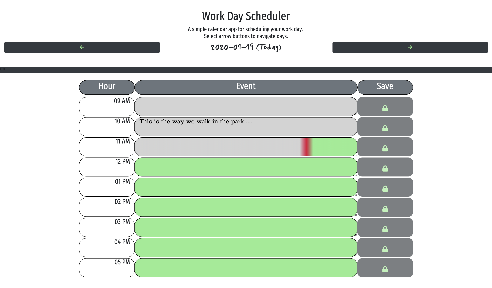

# Day Planner

A simple calendar application that allows the user to save events for each hour of the day. The user can navigate to future and past days.

The app displays standard business hours (9 a.m. to 5 p.m.). Each time slot represents one hour and contains the following:

* The time

* A field to hold user input

* A save button

* Current hour gradient color (grey -> red -> green) is based on % of hour gone by. Past days/hours are grey. Future days/hours are green. Colors dynamically change as time passes.

Clicking on the save button will store the time and user input in `localStorage`.

https://firefreet.github.io/calendar/

